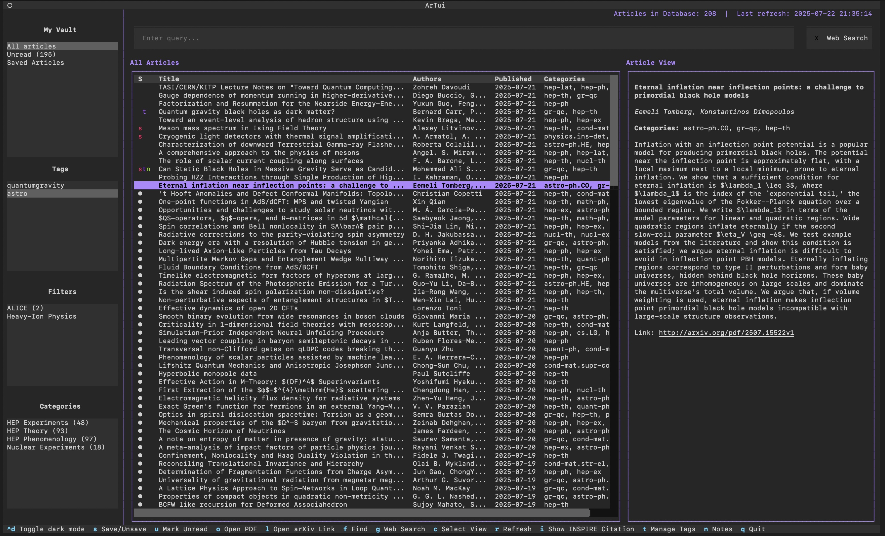
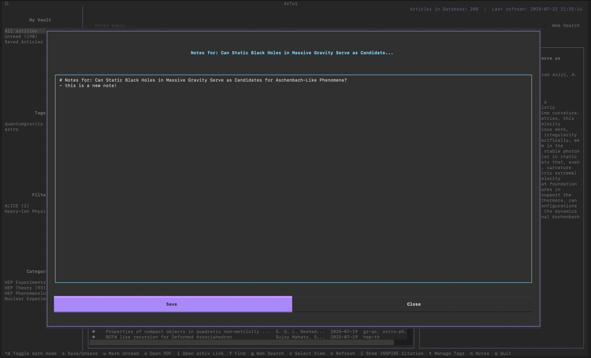
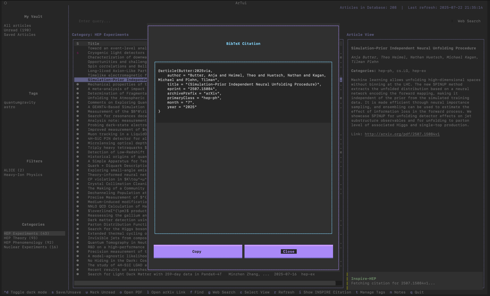

# ArTui - Stay up to date with recent ArXiv submissions!

[](https://opensource.org/licenses/MIT)
[](https://www.python.org/downloads/)
[](#)
[](https://github.com/Textualize/textual)
[](https://arxiv.org/)
[](https://inspirehep.net/)


A Terminal User Interface (TUI) application to stay up to date with recent arXiv submissions. Built with Python and Textual, featuring a persistent SQLite database. This tool was built with the help of AI to test AI capabilities and to build something useful for myself. The code is not pretty and I simply wanted to create a usable tool for myself.

**The main goal of the tool is to stay up to date with recent publications in your field**

# Disclaimer
This tool is not associated with arXiv and we thank arXiv for use of its open access interoperability. We also thank INSPIRE for providing their API free of charge for educational and informational use. The tool has been developed with the help of a mix of Claude Sonnet 4 and Gemini 2.5 Pro.
## Features
Stay up to date with recent publications in your field. New arXiv articles get fetched automatically according to predefined categories, and can be further filtered using custom filters. Read something you like? Save it for future reading right in your local PDF reader!

- **🚀 Smart Fetching**: Automatic background fetching of recent arXiv articles (last 7 days)
- **🔍 Advanced Filtering**: Configure custom filters with category and text-based criteria
- **📖 Reading Status**: Track viewed articles automatically
- **🗃️ Persistent Database**: All articles stored locally in SQLite for fast offline access
- **📁 Category Management**: Organize articles by arXiv categories (cs.AI, hep-th, etc.)
- **🏷️ Tag Management**: Add custom tags to articles and filter by tags
- **📝 Notes Management**: Create and edit markdown notes for articles
- **📚 Citations Information**: Fetch and view BibTeX citations from Inspire-HEP & browse references and citations
- **💾 Save System**: Save and organize your favorite articles
- **📱 Modern TUI**: Beautiful, responsive terminal interface with mouse support
- **📄 PDF Integration**: Download and open PDFs directly from the application
- **🔎 Full-Text Search**: Search across titles, authors, and abstracts

## Screenshots



*The ArXiv Reader interface showing the category sidebar, article list, and abstract panel*



*The Notes interface showing the markdown editor for taking notes on articles*



*The INSPIRE citation interface showing BibTeX citation information*


## Installation

### Requirements
- Python 3.8+
- Internet connection for fetching articles

### Setup

1. **Clone the repository**:
```bash
git clone <repository-url>
cd arxivreader
```

2. **Install locally with pip**:
```bash
# Install in development mode (recommended for local development)
pip install -e .

# Or install normally
pip install .
```

3. **Run the application**:
```bash
artui
```

4. **First time setup**:
After opening the application for the first time, press the 'r' button to refresh and populate the database with recent articles.

## Configuration

### User Data Directory

ArTui stores all user data in a centralized location for better organization and portability:

**Default Location**: `~/.artui/`

**Directory Structure**:
```
~/.artui/
├── config.yaml          # Configuration file
├── arxiv_articles.db     # SQLite database
├── articles/             # Downloaded PDF files
└── notes/               # Article notes (markdown files)
```

### Custom User Data Directory

You can customize the user data directory location in several ways:

1. **Environment Variable**:
```bash
export ARTUI_DATA_DIR="/path/to/custom/directory"
artui
```

2. **Command Line Parameter**:
```bash
artui --user-dir "/path/to/custom/directory"
```

### User Directory Management

View user directory information:
```bash
artui userdir info
```

Migrate existing data from current directory:
```bash
artui userdir migrate
```

### Configuration File

Create or edit `config.yaml` in your user data directory to configure categories and filters:

```yaml
categories:
  # Display Name: arXiv category code
  "Machine Learning": "cs.LG"
  "Artificial Intelligence": "cs.AI"
  "HEP Theory": "hep-th"
  "HEP Experiments": "hep-ex"
  "Quantum Physics": "quant-ph"

filters:
  # Custom filters with advanced criteria
  "ALICE Experiment":
    categories:
      - hep-ex
      - hep-ph
    query: "ALICE"
  
  "Deep Learning":
    categories:
      - cs.LG
      - cs.CV
    query: "deep learning OR neural network"
  
  "COVID Research":
    query: "COVID-19 OR coronavirus OR SARS-CoV-2"
```

## Usage

### Running the Application

```bash
artui
```

The application will:
1. Create the database file if it doesn't exist
2. Start the TUI interface
3. Automatically refresh articles (same as pressing 'r') - fetching recent articles (last 7 days)
4. Load the first configured category/filter automatically

### Key Bindings

| Key | Action |
|-----|--------|
| `s` | Save/Unsave the selected article |
| `u` | Mark article as unread |
| `o` | Download and open PDF |
| `i` | Show BibTeX citation from Inspire-HEP |
| `t` | Manage tags for the selected article |
| `n` | Create/edit notes for the selected article |
| `f` | Focus search box |
| `g` | Enable web search and focus search box |
| `c` | Show category/filter selection popup |
| `r` | Refresh and fetch new articles |
| `q` | Quit application |
| `Ctrl+d` | Toggle dark/light mode |
| `↑/↓` | Navigate article list |
| `Enter` | Select article (shows abstract) |
| `Mouse` | Click to navigate and select |

### Status Indicators

In the article list, the first column shows status:
- `●` - New/unread article
- ` ` (space) - Article has been viewed
- `s` - Article is saved/bookmarked
- `t` - Article has tags
- `n` - Article has note

## License

This project is licensed under the MIT License - see the [LICENSE](LICENSE) file for details.

Copyright 2025 Florian Jonas

## Support

For issues and feature requests, please use the GitHub issue tracker. 
