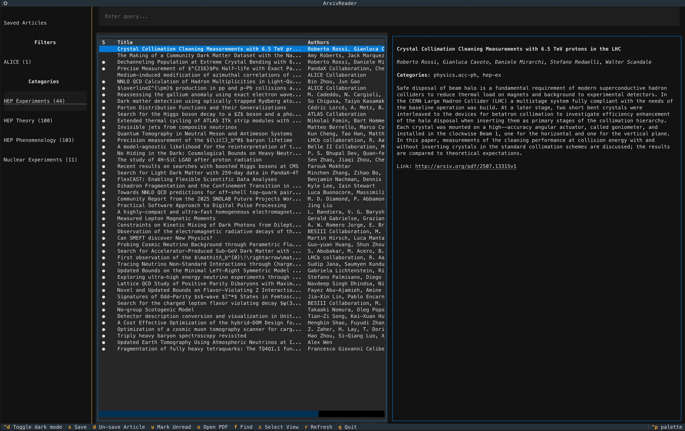

# ArTui

A Terminal User Interface (TUI) application for browsing, searching, and managing arXiv research papers. Built with Python and Textual, featuring a persistent SQLite database. This tool was built with AI to test AI capabilities and to build something useful for myself. The code is not pretty and I simply wanted to create a usable tool for myself. 

# Disclaimer
This tool is not associated with arXiv and we thank arXiv for use of its open access interoperability. We also thank INSPIRE for provisding their API free of charge for educational and informational use. The tool has been developed with the help of a a mix of Claude Sonnet 4 and Gemini 2.5 Pro.
## Features

- **🗃️ Persistent Database**: All articles stored locally in SQLite for fast offline access
- **🚀 Smart Fetching**: Automatic background fetching of recent articles (last 7 days)
- **🔍 Advanced Filtering**: Configure custom filters with category and text-based criteria
- **📁 Category Management**: Organize articles by arXiv categories (cs.AI, hep-th, etc.)
- **🏷️ Tag Management**: Add custom tags to articles and filter by tags
- **📝 Notes Management**: Create and edit markdown notes for articles
- **📚 BibTeX Citations**: Fetch and view BibTeX citations from Inspire-HEP
- **💾 Save System**: Save and organize your favorite articles
- **📖 Reading Status**: Track viewed articles automatically
- **📱 Modern TUI**: Beautiful, responsive terminal interface with mouse support
- **📄 PDF Integration**: Download and open PDFs directly from the application
- **🔎 Full-Text Search**: Search across titles, authors, and abstracts

- **⚡ Fast Performance**: Local database ensures instant search and browsing

## Screenshot



*The ArXiv Reader interface showing the category sidebar, article list, and abstract panel*

## Installation

### Requirements
- Python 3.8+
- Internet connection for fetching articles

### Setup

1. **Clone the repository**:
```bash
git clone <repository-url>
```

2. **Create a virtual environment** (recommended):
```bash
python -m venv .venv
source .venv/bin/activate  # On Windows: .venv\Scripts\activate
```

3. **Install dependencies**:
```bash
pip install -r requirements.txt
```
4. After first open
Press the 'r' button to refresh the database
## Configuration

Create or edit `arxiv_config.yaml` to configure categories and filters:

```yaml
categories:
  # Display Name: arXiv category code
  "Machine Learning": "cs.LG"
  "Artificial Intelligence": "cs.AI"
  "HEP Theory": "hep-th"
  "HEP Experiments": "hep-ex"
  "Quantum Physics": "quant-ph"

filters:
  # Custom filters with advanced criteria
  "ALICE Experiment":
    categories:
      - hep-ex
      - hep-ph
    query: "ALICE"
  
  "Deep Learning":
    categories:
      - cs.LG
      - cs.CV
    query: "deep learning OR neural network"
  
  "COVID Research":
    query: "COVID-19 OR coronavirus OR SARS-CoV-2"
```

## Usage

### Running the Application

```bash
python main.py
```

The application will:
1. Create the database file if it doesn't exist
2. Start the TUI interface
3. Automatically refresh articles (same as pressing 'r') - fetching recent articles (last 7 days)
4. Load the first configured category/filter automatically

### Interface Overview

```
┌─ ArXiv Reader ────────────────────────────────────────┐
│                                                       │
│ ┌─ Left Panel ──┐  ┌─ Main Panel ──────────────────┐  │
│ │ Saved Articles│  │ Search: [Enter query...]     │  │
│ │               │  │                               │  │
│ │ Filters       │  │ ┌─ Article List ─┐ ┌─ Abstract│  │
│ │ • Deep Learning│  │ │S│Title    │Auth│ │         │  │
│ │ • COVID Research│  │ │●│Article 1│...│ │ Selected │  │
│ │               │  │ │ │Article 2│...│ │ article  │  │
│ │ Categories    │  │ └─────────────────┘ │ details  │  │
│ │ • AI          │  │                     │ and      │  │
│ │ • ML          │  │                     │ abstract │  │
│ └───────────────┘  └─────────────────────┘         │  │
└───────────────────────────────────────────────────────┘
```

### Key Bindings

| Key | Action |
|-----|--------|
| `s` | Save/bookmark the selected article |
| `d` | Remove article from saved list |
| `u` | Mark article as unread |
| `o` | Download and open PDF |
| `i` | Show BibTeX citation from Inspire-HEP |
| `t` | Manage tags for the selected article |
| `n` | Create/edit notes for the selected article |
| `f` | Focus search box |
| `g` | Enable global search and focus search box |
| `c` | Show category/filter selection popup |
| `r` | Refresh and fetch new articles |
| `q` | Quit application |
| `Ctrl+d` | Toggle dark/light mode |
| `↑/↓` | Navigate article list |
| `Enter` | Select article (shows abstract) |
| `Mouse` | Click to navigate and select |

### Status Indicators

In the article list, the first column shows status:
- `●` - New/unread article
- ` ` (space) - Article has been viewed
- `s` - Article is saved/bookmarked
- `t` - Article has tags

### Workflow

1. **Browse Categories**: Click on categories in the left panel
2. **Use Filters**: Click on custom filters for targeted searches  
3. **Search**: Type in the search box for text-based queries
4. **Refresh**: Press `r` to fetch the latest articles from arXiv
5. **Save Articles**: Press `s` to bookmark interesting articles
6. **Tag & Take Notes**: Use `t` and `n` to organize and annotate articles
7. **Read Papers**: Press `o` to download and open PDFs
8. **View Saved**: Click "Saved Articles" to see your bookmarks

## Database

### Overview

The application uses SQLite to store:
- **All fetched articles** with full metadata
- **User interactions** (saved/viewed status)
- **Fetch history** to avoid duplicate API calls
- **Notes** for each article
- **Tags** for each article

### Database Schema

**Articles Table**: Stores article metadata
- Article ID, title, authors, abstract
- Categories, publication date, PDF URL
- Creation and update timestamps
- Path to notes file

**Article Status Table**: Tracks user interactions
- Saved/viewed flags with timestamps
- Links to articles table

**Fetched Categories Table**: Tracks fetch history
- Category codes, last fetch time
- Article counts per fetch

**Tags Table**: Stores all unique tags created by the user

**Article Tags Table**: Links articles and tags in a many-to-many relationship

### Automatic Fetching

- **Startup**: Automatically runs the same refresh as pressing 'r' - fetches recent articles (7 days) for all categories/filters
- **Background**: Non-blocking, won't interrupt UI usage  
- **Smart Caching**: Avoids re-fetching recently updated categories
- **Duplicate Prevention**: Articles only stored once, even if in multiple categories


### Data Migration

The application automatically migrates data from legacy text files:
- `saved_articles.txt` → Database saved status
- `viewed_articles.txt` → Database viewed status

## Command Line Tools

### Standalone Fetcher

Run the fetcher independently for batch operations:

```bash
# Fetch recent articles (last 7 days)
python startup_fetcher.py --recent 7

# Full fetch of all configured categories
python startup_fetcher.py

# Force fetch even if recently updated
python startup_fetcher.py --force

# Custom configuration file
python startup_fetcher.py --config custom_config.yaml

# Custom database location
python startup_fetcher.py --db custom_articles.db
```

### Database Management

```bash
# Reset database (delete arxiv_articles.db)
rm arxiv_articles.db

# Backup database
cp arxiv_articles.db backup_$(date +%Y%m%d).db
```

## Performance

### Fetching Limits

- **Startup fetch**: 100 articles per category/filter (recent 7 days)
- **Full fetch**: 200 articles per category/filter (all time)
- **Display limits**: 100 articles in UI (configurable)

### Storage

- **No per-category limits**: Database can store unlimited articles
- **Efficient storage**: Deduplication prevents duplicate articles
- **Fast queries**: Indexed on common search fields
- **Scalable**: SQLite handles thousands of articles efficiently

### Network Usage

- **Minimal API calls**: Smart caching prevents unnecessary requests
- **Background operation**: Fetching doesn't block UI
- **Respectful**: Rate-limited to avoid overwhelming arXiv servers

## Advanced Configuration

### Filter Examples

**Complex Boolean Queries**:
```yaml
filters:
  "AI Safety":
    categories: ["cs.AI", "cs.LG", "cs.CY"]
    query: "(AI safety) OR (artificial intelligence safety) OR (alignment)"
  
  "Quantum ML":
    categories: ["quant-ph", "cs.LG"]
    query: "(quantum machine learning) OR (quantum neural network)"
```

**Category-Only Filters**:
```yaml
filters:
  "All Physics":
    categories:
      - hep-th
      - hep-ex  
      - quant-ph
      - astro-ph
```

**Text-Only Filters**:
```yaml
filters:
  "COVID Research":
    query: "COVID-19 OR coronavirus OR pandemic"
```

### Customizing Limits

To show more articles in the UI, modify the `limit` parameters in `main.py`:

```python
# In fetch_articles_from_db method
db_results = self.db.get_articles_by_category(self.current_selection, limit=500)
```

## Troubleshooting

### Reset Everything

```bash
# Delete database and start fresh
rm arxiv_articles.db

# Delete downloaded PDFs
rm -rf articles/

# Reset configuration to default
cp arxiv_config.yaml arxiv_config.yaml.backup
# Edit arxiv_config.yaml with desired settings
```


## Dependencies

- `textual` - Modern TUI framework
- `arxiv` - arXiv API client
- `pyyaml` - YAML configuration parsing  
- `requests` - HTTP library for PDF downloads
- `sqlite3` - Database (built into Python)


## Support

For issues and feature requests, please use the GitHub issue tracker. 
