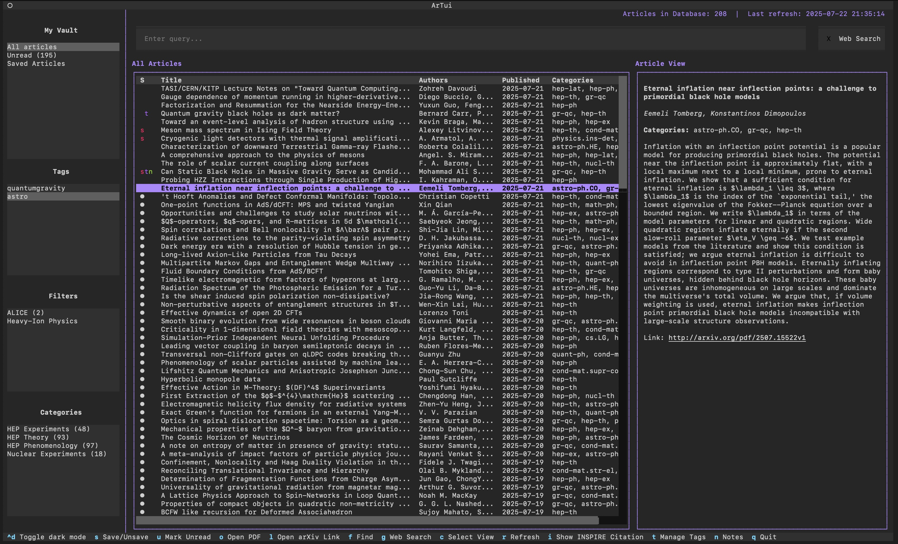
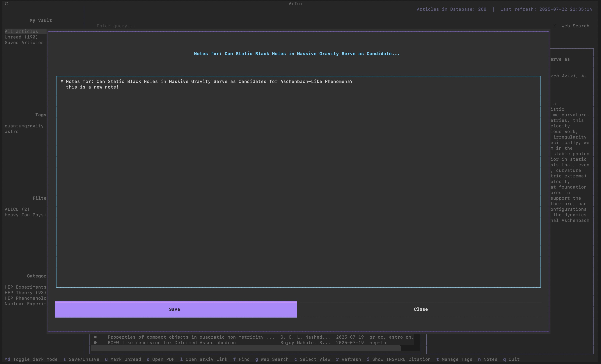
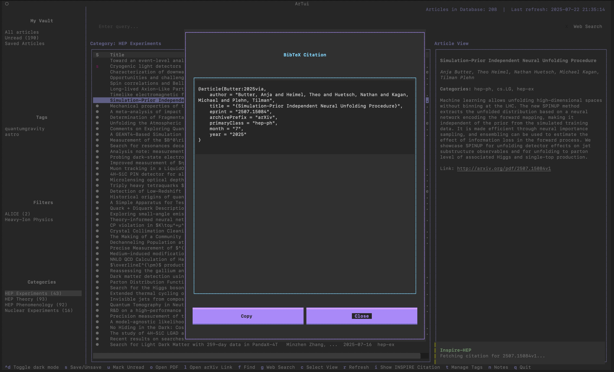

# ArTui - Stay up to date with recent ArXiv submissions!

[](https://opensource.org/licenses/MIT)
[](https://pypi.org/project/artui/)
[](https://www.python.org/downloads/)
[](#)
[](https://github.com/Textualize/textual)
[](https://arxiv.org/)
[](https://inspirehep.net/)


A Terminal User Interface (TUI) application to stay up to date with recent arXiv submissions. Built with Python and Textual, featuring a persistent SQLite database. This tool was built with the help of AI to test AI capabilities and to build something useful for myself. The code is not pretty and I simply wanted to create a usable tool for myself.

**The main goal of the tool is to stay up to date with recent publications in your field**

## Disclaimer
This tool is not associated with arXiv and we thank arXiv for use of its open access interoperability. We also thank INSPIRE for providing their API free of charge for educational and informational use. The tool has been developed with the help of a mix of Claude Sonnet 4 and Gemini 2.5 Pro.

## How it works

**Feed** — Your main view. Shows recent arXiv papers (last 7 days) from all subscribed categories. New submissions appear automatically after each fetch. Read articles are tracked and cleaned up after a configurable retention period to keep your feed fresh.

**Categories** — arXiv subject areas you want to follow (e.g. `hep-th`, `cs.AI`, `astro-ph.HE`). Every article that falls under a subscribed category will show up in your feed. Configure them in the config file.

**Filters** — Optional keyword rules applied on top of categories. A filter targets one or more categories and keeps only articles whose title or abstract match your criteria — useful for narrowing a broad category to your specific topics of interest.

**Library** — Articles you explicitly save are kept here indefinitely. Unlike the feed, saved articles are never auto-removed. Enrich them with custom tags and markdown notes for easy organisation and reference.

**Global Search** — Search the full arXiv database beyond your subscribed categories. Any article found this way can be added directly to your library.

**Citation Network** — Browse citations of a given article using inspire-hep without leaving the terminal.

## Screenshots



*The ArXiv Reader interface showing the category sidebar, article list, and abstract panel*



*The Notes interface showing the markdown editor for taking notes on articles*



*The INSPIRE citation interface showing BibTeX citation information*

## Installation

### Requirements
- Python 3.8+
- Internet connection for fetching articles

### Recommended: pipx (isolated, no venv management)

[pipx](https://pipx.pypa.io) installs CLI tools into their own isolated environment and makes them available system-wide — no manual virtual environment needed.

```bash
pipx install artui
```

To install pipx itself:
```bash
# macOS
brew install pipx && pipx ensurepath

# Linux / Windows (via pip)
pip install --user pipx && pipx ensurepath
```

### Alternative: pip

```bash
pip install artui
```

### From source (development)

```bash
git clone https://github.com/fjonasALICE/arTui
cd artui
pip install -e .
```

## Configuration

### User Data Directory

ArTui stores all user data in a centralized location for better organization and portability:

**Default Location**: `~/.artui/`

**Directory Structure**:
```
~/.artui/
├── config.yaml          # Configuration file
├── arxiv_articles.db     # SQLite database
├── articles/             # Downloaded PDF files
└── notes/               # Article notes (markdown files)
```

### Custom User Data Directory

You can customize the user data directory location in several ways:

1. **Environment Variable**:
```bash
export ARTUI_DATA_DIR="/path/to/custom/directory"
artui
```

2. **Command Line Parameter**:
```bash
artui --user-dir "/path/to/custom/directory"
```

### User Directory Management

View user directory information:
```bash
artui userdir info
```

Migrate existing data from current directory:
```bash
artui userdir migrate
```

### Configuration File

Create or edit `config.yaml` in your user data directory to configure categories and filters:

```yaml
# Feed retention period in days - articles older than this are hidden from feed views unless unread
feed_retention_days: 30

categories:
  # Display Name: arXiv category code
  "Machine Learning": "cs.LG"
  "Artificial Intelligence": "cs.AI"
  "HEP Theory": "hep-th"
  "HEP Experiments": "hep-ex"
  "Quantum Physics": "quant-ph"

filters:
  # Custom filters with advanced criteria
  "ALICE Experiment":
    categories:
      - hep-ex
      - hep-ph
    query: "ALICE"
  
  "Deep Learning":
    categories:
      - cs.LG
      - cs.CV
    query: "deep learning OR neural network"
  
  "COVID Research":
    query: "COVID-19 OR coronavirus OR SARS-CoV-2"
```

## Usage

### Running the Application

```bash
artui
```

On first launch a config wizard will open — set your categories, save, and the app starts fetching. After that, `r` manually triggers a refresh.

The application will:
1. Create the database file if it doesn't exist
2. Start the TUI interface
3. Automatically refresh articles (fetching the last 7 days)
4. Load the first configured category/filter automatically

### Key Bindings

| Key | Action |
|-----|--------|
| `s` | Save/Unsave the selected article |
| `u` | Mark article as unread |
| `o` | Download and open PDF |
| `i` | Show BibTeX citation from Inspire-HEP |
| `t` | Manage tags for the selected article |
| `n` | Create/edit notes for the selected article |
| `f` | Focus search box |
| `g` | Enable web search and focus search box |
| `c` | Show category/filter selection popup |
| `r` | Refresh and fetch new articles |
| `q` | Quit application |
| `Ctrl+d` | Toggle dark/light mode |
| `↑/↓` | Navigate article list |
| `Enter` | Select article (shows abstract) |
| `Mouse` | Click to navigate and select |

### Status Indicators

In the article list, the first column shows status:
- `●` - New/unread article
- ` ` (space) - Article has been viewed
- `s` - Article is saved/bookmarked
- `t` - Article has tags
- `n` - Article has note

## License

This project is licensed under the MIT License - see the [LICENSE](LICENSE) file for details.

Copyright 2025 Florian Jonas

## Support

For issues and feature requests, please use the GitHub issue tracker.

## Dependencies

This project depends on the following Python packages:

- [textual](https://pypi.org/project/textual/) - `textual[syntax]>=0.41.0`
- [arxiv](https://pypi.org/project/arxiv/) - `arxiv>=2.0.0`
- [pyyaml](https://pypi.org/project/pyyaml/) - `pyyaml>=6.0`
- [requests](https://pypi.org/project/requests/) - `requests>=2.25.0`
- [pyperclip](https://pypi.org/project/pyperclip/) - `pyperclip>=1.8.0`
- [pygments](https://pypi.org/project/pygments/) - `pygments>=2.10.0`
- [pyinspirehep](https://pypi.org/project/pyinspirehep/) - `pyinspirehep>=0.1.0`
